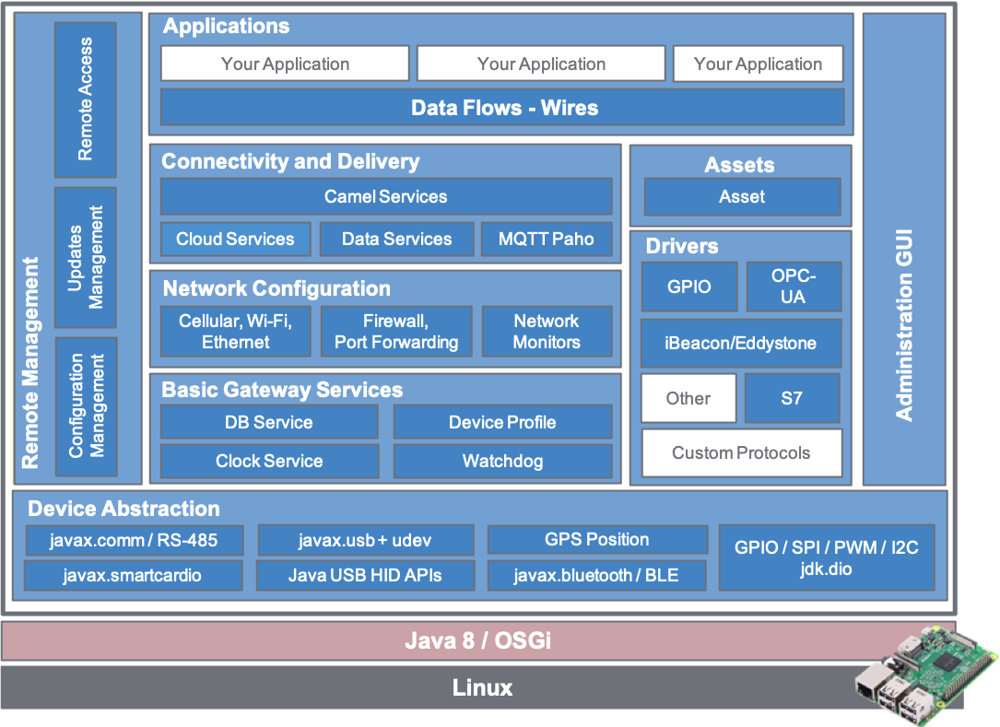
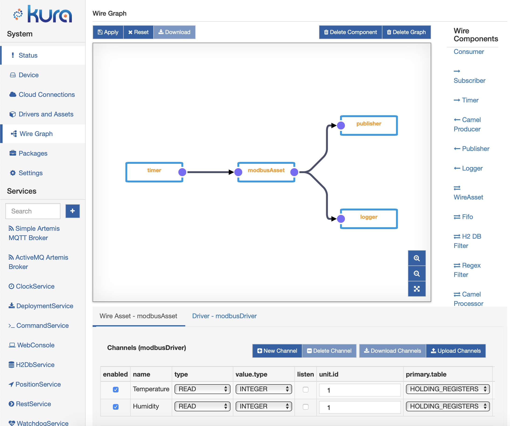

# Overview

The emergence of an Internet of Thing (IoT) service gateway model running modern software stacks, operating on the edge of an IoT deployment as an aggregator and controller, has opened up the possibility of enabling enterprise level technologies to IoT gateways.

Advanced software frameworks, which abstract and isolate the developer from the complexity of the hardware and the networking sub-systems, re-define the development and re-usability of integrated hardware and software solutions.

Eclipse Kura is an Eclipse IoT project that provides a platform for building IoT gateways. It is a smart application container that enables remote management of such gateways and provides a wide range of APIs for allowing you to write and deploy your own IoT application.

Kura runs on top of the Java Virtual Machine (JVM) and leverages OSGi, a dynamic component system for Java, to simplify the process of writing reusable software building blocks. Kura APIs offer  easy access to the underlying hardware including serial ports, GPS, watchdog, USB, GPIOs, I2C, etc. It also offer OSGI bundle to simplify the management of network configurations, the communication with IoT servers, and the remote management of the gateway.

Kura components are designed as configurable OSGi Declarative Service exposing service API and raising events. While several Kura components are in pure Java, others are invoked through JNI and have a dependency on the Linux operating system.

Kura comes with the following services:

* I/O Services
	* Serial port access through javax.comm 2.0 API or OSGi I/O connection
    *  USB access and events through javax.usb, HID API, custom extensions
    *  Bluetooth access through javax.bluetooth or OSGi I/O connection
    *  Position Service for GPS information from an NMEA stream
    *  Clock Service for the synchronization of the system clock
    *  Kura API for GPIO/PWM/I2C/SPI access
* Data Services
    * Store and forward functionality for the telemetry data collected by the gateway and published to remote servers.
    * Policy-driven publishing system, which abstracts the application developer from the complexity of the network layer and the
	publishing protocol used. Eclipse Paho and its MQTT client provide the default messaging library used.
* Cloud Services
    * Easy to use API layer for IoT application to communicate with a remote server. In addition to simple publish/subscribe,
      the Cloud Service API simplifies the implementation of more complex interaction flows like request/response or remote resource management.
      Allow for a single connection to a remote server to be shared across more than one application in the gateway providing the necessary topic partitioning.
* Configuration Service
    * Leverage the OSGi specifications ConfigurationAdmin and MetaType to provide a snapshot service to import/export the configuration of all registered services in the container.
* Remote Management
    * Allow for remote management of the IoT applications installed in Kura including their deployment, upgrade and configuration management. The Remote Management
      service relies on the Configuration Service and the Cloud Service.
* Networking
    * Provide API for introspects and configure the network interfaces available in the gateway like Ethernet, Wifi, and Cellular modems.
* Watchdog Service
    * Register critical components to the Watchdog Service, which will force a system reset through the hardware watchdog when a problem is detected.
* Web administration interface
    * Offer a web-based management console running within the Kura container to manage the gateway.
* Drivers and Assets
    * A unified model is introduced to simplify the communication with the devices attached to the gateway. The Driver encapsulates the communication protocol and its configuration parameters, while the Asset, which is generic across Drivers, models the information data channels towards the device. When an Asset is created, a Mirror of the device is automatically available for on-demand read and writes via Java APIs or via Cloud through remote messages.
* Wires
    * Offers modular and visual data flow programming tool to define data collection and processing pipelines at the edge by simply selecting components from a palette and wiring them together. This way users can, for example, configure an Asset, periodically acquire data from its channels, store them in the gateway, filter or aggregate them using powerful SQL queries, and send the results to the Cloud. The Eclipse Kura Marketplace is a repository from which additional Wires components can be installed into your Kura runtime with a simple drag-and-drop.

